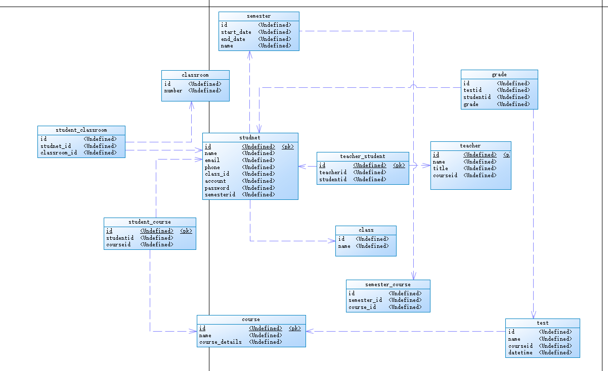

The YB College database is designed to support student management, teacher management, and course management.
It should include entities such as students, teachers, courses, classrooms, and a test/grade system.
Every student needs to join a class, attend the tests, and then receive grades for their performance.
There must be classrooms in the college, and each classroom will be assigned to certain courses.
A semester management system is also required, in which students are associated with a specific semester.
Each teacher has a job position as their title, and they are associated with a specific class.

## Student

id
name
email
phone
classid
semesterid
account
password

## teacher

id
name
title
courseId

## course

Id
name
detials

## teacher_students

id
teacherId
studentId

## student_course

id
studentId
courseid

## class

id
name

## classroom

id
number

## student_classroom

id
student_id
classroom_id

## semestor

id
start_date
end_date
name

## semestor_course

id
semester_id
course_id

## test

id
name
courseid
datetime

## grade

id
testid
studentid
grade

