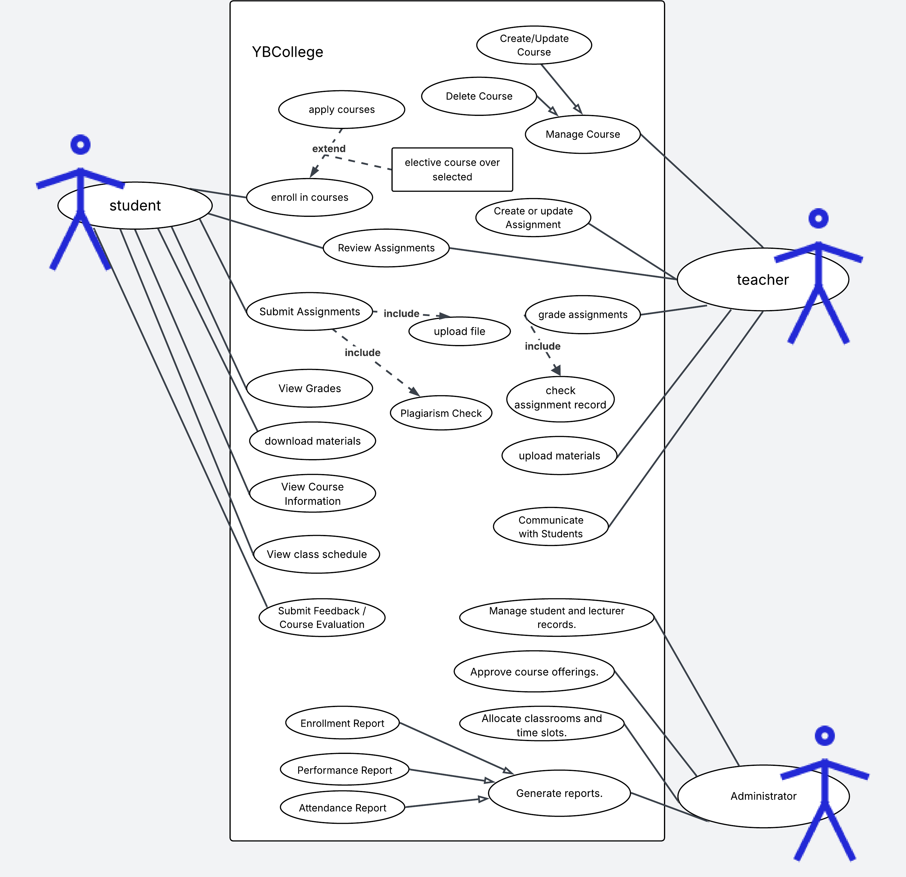

1. Student

   1. enroll in courses
   2. Apply for a Class
   3. Submit Assignments
   4. View Grades
   5. View Course Information
   6. View class schedule

2. Teacher

   1. Create or update Courses
   2. Create or update Assignment
   3. Manage Students in a Class
   4. Review Assignments
   5. Assign Grades to Students
   6. Arrange Course Schedule
   7. upload your material

   
